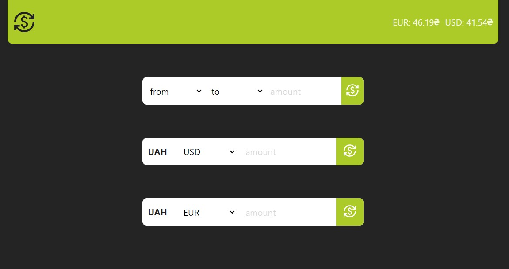

# Currency Exchange App

## Features

- **Currency Conversion:** Convert amounts from one currency to another using the latest exchange rates.
- **Current Exchange Rates:** View the current exchange rates of various currencies relative to the Ukrainian Hryvnia (UAH).
- **Dynamic Exchange Rates:** Exchange rates are updated regularly to reflect the latest market conditions.

## Technology stack

React.js, JS, React Icons
